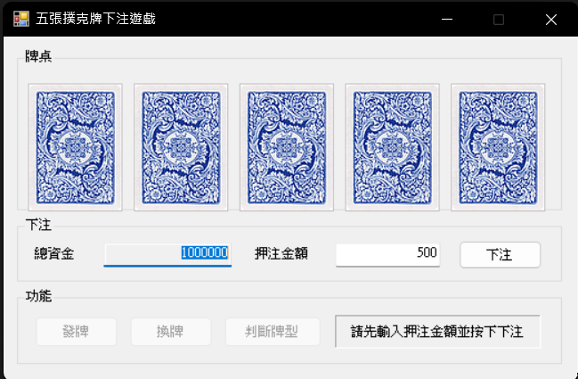
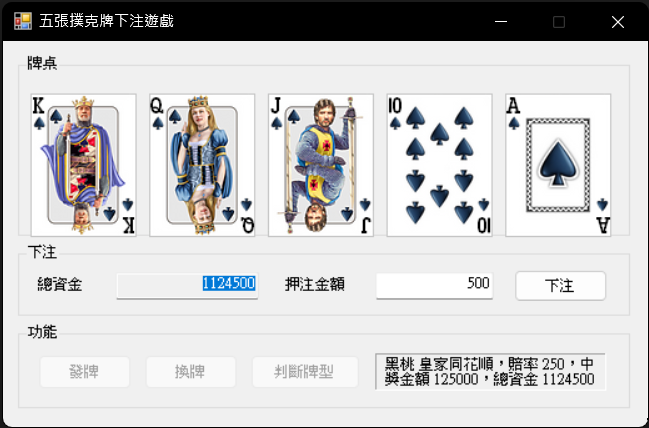

# 五張撲克牌下注遊戲

## 專案簡介

本專案是 Windows Programming (II) 的「五張撲克牌」作業完成版，依照課堂簡報的方式使用圖片資源、動態 `PictureBox` 控制項、發牌、換牌、判斷牌型，並加入下注功能。

玩家可以輸入押注金額，發牌後選擇要換的牌，再按下「判斷牌型」計算賠率與中獎金額。總資金預設為 1,000,000。

## 功能

- 動態產生 5 張撲克牌 `PictureBox`
- 使用 `Properties.Resources.ResourceManager.GetObject()` 讀取撲克牌圖片
- 發牌、選牌、換牌、判斷牌型
- 加入下注金額與總資金管理
- 依照牌型賠率計算中獎金額
- 支援隱藏測試按鍵，方便快速測試牌型

## 牌型賠率

| 牌型 | 賠率 |
|---|---:|
| 皇家同花順 | 250 |
| 同花順 | 50 |
| 四條 | 25 |
| 葫蘆 | 9 |
| 同花 | 6 |
| 順子 | 4 |
| 三條 | 3 |
| 兩對 | 2 |
| 一對 | 1 |
| 雜牌 | 0 |

## 執行說明

1. 使用 Windows 的 Visual Studio 開啟 `PokerBetting.sln`。
2. 確認已安裝 `.NET Framework 4.7.2` 或相容版本。
3. 按下 `F5` 執行。
4. 輸入押注金額並按「下注」。
5. 按「發牌」。
6. 點擊要換掉的牌，牌會變成牌背。
7. 按「換牌」，或直接按「判斷牌型」。
8. 系統會依牌型顯示賠率、中獎金額與目前總資金。

## 隱藏測試按鍵

在一局遊戲發牌後，可按下以下按鍵載入測試牌型：

| 按鍵 | 測試牌型 |
|---|---|
| q | 皇家同花順 |
| w | 同花順 |
| a | 順子 |
| r | 四條 |
| t | 葫蘆 |
| e | 同花 |
| y | 三條 |
| u | 兩對 |
| i | 一對 |

載入後按「判斷牌型」即可檢查結果。

## 執行畫面

